# Guideline

Identity and access in `explore-iam` helps sibling Explore products and any
relying party authenticate people and services, obtain tokens through standard
protocols, and grant only the access a job needs—when those outcomes are clear
and auditable. Implement that control plane with Spring Boot, Spring Security,
and Spring Authorization Server without shipping ad-hoc login stacks inside
every application.

## Introduction

This guideline describes how to implement identity, policy, STS, federation,
applications, groups, MFA, and audit with Spring Boot, Spring Security, and
Spring Authorization Server. Prefer the smallest Spring configuration that
works; use Apple and GitHub only as short capability mirrors. Keep protocol and
NIST constraints when they shape the Spring setup. Vocabulary lives in the
[Glossary](Glossary.md); living architecture (optional) in the
[C4 model](developer/c4-model/); operator steps in the
[User guide](user-guide/README.md).

Diagrams below show **target best practices** for easy integration and
configuration. They are independent of today’s package layout; align code to
these shapes over time.

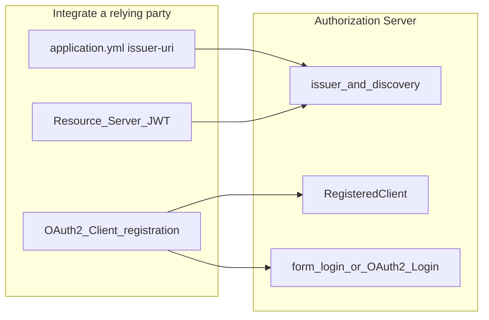

## Best practices

### Single issuer

**Set one issuer URL and reuse it everywhere.** On the Authorization Server set
`spring.security.oauth2.authorizationserver.issuer`. On every relying party set
the same value as `issuer-uri` for both OAuth2 Client and Resource Server. Avoid
per-app custom token formats. Same single-account trust shape as an Apple
Account or a GitHub org identity host. See
[Spring Authorization Server](https://docs.spring.io/spring-authorization-server/reference/index.html)
and
[OpenID Connect Core](https://openid.net/specs/openid-connect-core-1_0.html).

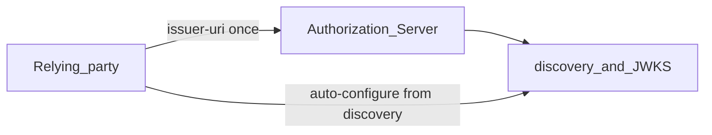

### Authorization Code and PKCE

**Use Authorization Code with PKCE as the default browser login.** Configure
the Authorization Server for `authorization_code` only (plus optional refresh).
Require PKCE for public clients. Match redirect URIs exactly. Reject Implicit
and password grants. See
[OAuth 2.1](https://datatracker.ietf.org/doc/html/draft-ietf-oauth-v2-1),
[RFC 7636](https://datatracker.ietf.org/doc/html/rfc7636), and
[RFC 9700](https://datatracker.ietf.org/doc/html/rfc9700).

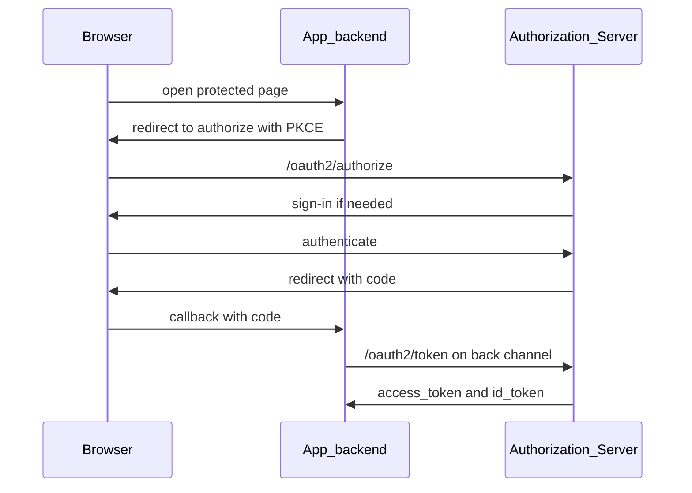

### Client secrets

**Keep secrets on the back channel only.** Use
`client_secret_basic` or `client_secret_post` on `/oauth2/token`. Never put
secrets in SPA bundles or authorize query strings. Let discovery publish JWKS.
See
[Spring Security OAuth2](https://docs.spring.io/spring-security/reference/servlet/oauth2/index.html),
[RFC 6750](https://datatracker.ietf.org/doc/html/rfc6750), and
[RFC 7517](https://datatracker.ietf.org/doc/html/rfc7517).

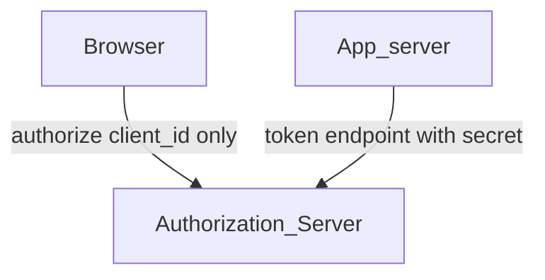

### Applications

**Register each app as a `RegisteredClient` with least scopes and exact redirect
URIs.** Prefer property- or YAML-driven registration for local bootstrap; use a
`RegisteredClientRepository` (JDBC when you need persistence). Same app-scoped
boundary as App Store Connect app access and GitHub Apps. See
[Core configuration model](https://docs.spring.io/spring-authorization-server/reference/core/configuration-model.html),
[Overview of accounts and roles](https://developer.apple.com/help/app-store-connect/manage-your-team/overview-of-accounts-and-roles),
and [GitHub Apps](https://docs.github.com/en/apps).

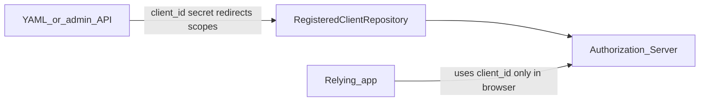

### Principals

**Model User, Group, and Role; authenticate with Spring Security form login,
`UserDetailsService`, and `PasswordEncoder`.** Prefer short-lived sessions over
permanent elevation. Same lasting-account shape as
[Managing accounts](https://developer.apple.com/design/human-interface-guidelines/managing-accounts).

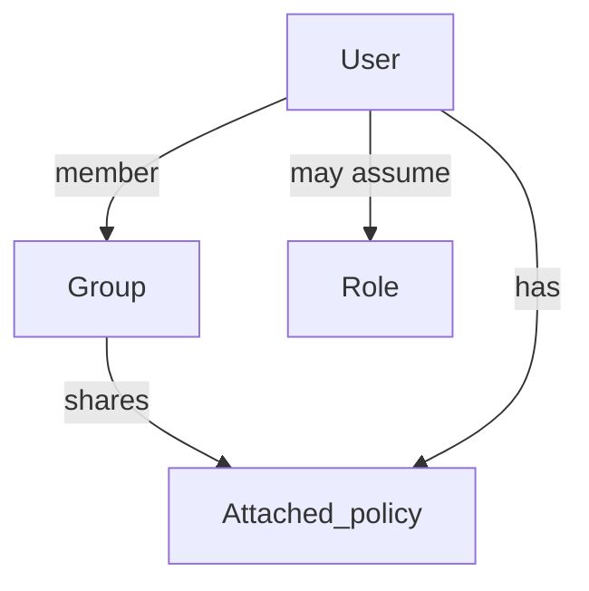

### Permission points

**Protect APIs with `@EnableMethodSecurity` / `@PreAuthorize`, and evaluate
Action + Resource (+ Condition) in one policy service.** Prefer fine-grained
permissions over a global admin flag—same idea as GitHub fine-grained tokens and
Apple scoped roles. See
[Method Security](https://docs.spring.io/spring-security/reference/servlet/authorization/method-security.html),
[Managing personal access tokens](https://docs.github.com/en/authentication/keeping-your-account-and-data-secure/managing-your-personal-access-tokens),
and
[Apple Developer Program roles](https://developer.apple.com/help/account/access/roles).

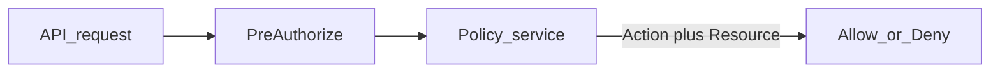

### User groups

**Grant shared access through Group membership and attached policies.** Keep
Role for temporary elevation (AssumeRole), not as a Group substitute. Same
team-shaped access as GitHub Teams and Apple Developer team membership. See
[About teams](https://docs.github.com/en/organizations/organizing-members-into-teams/about-teams)
and
[Change team member roles](https://developer.apple.com/help/account/access/change-team-member-roles).

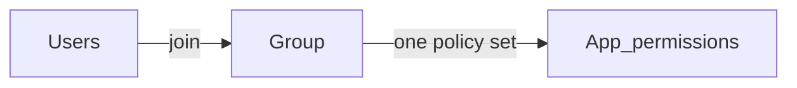

### Policy evaluation

**Evaluate Deny, then Allow, then implicit Deny in one place.** Call that
service from method security or an evaluate API; do not scatter ad-hoc checks.
See [NIST SP 800-207](https://csrc.nist.gov/pubs/sp/800/207/final).

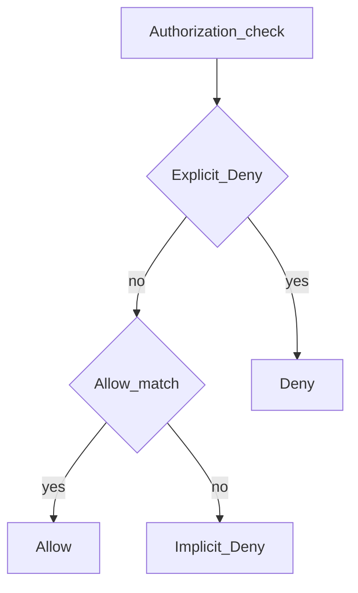

### Temporary credentials

**Issue short-lived JWTs only after an AssumeRole-style trust check.** Configure
token TTL in Spring; validate `exp` with Resource Server JWT. Prefer this over
long-lived shared passwords for automation. See
[OAuth2 Resource Server JWT](https://docs.spring.io/spring-security/reference/servlet/oauth2/resource-server/jwt.html).

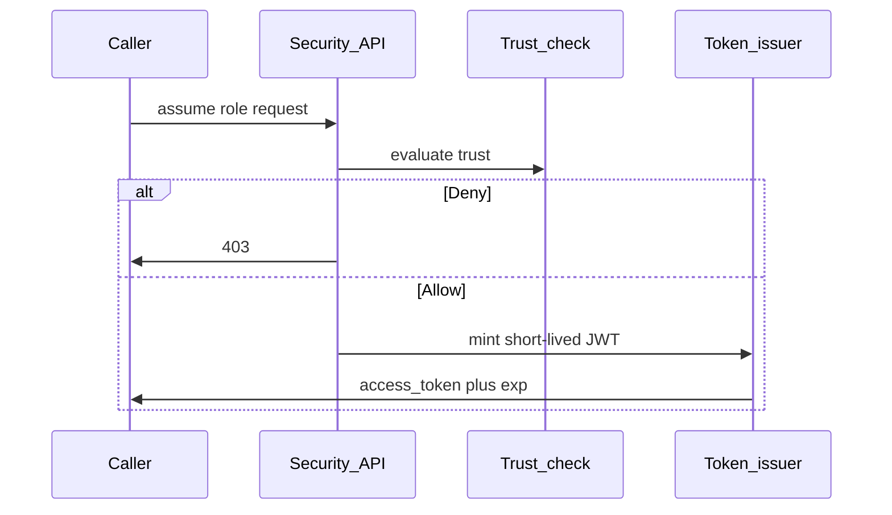

### MFA

**Add MFA or WebAuthn on the Security filter chain before high-value sessions.**
Keep passwords on `PasswordEncoder`; prefer passkeys where feasible. Same
assurance bar as Apple Account two-factor and GitHub org-required 2FA. See
[Spring Security Authentication](https://docs.spring.io/spring-security/reference/servlet/authentication/index.html),
[WebAuthn](https://www.w3.org/TR/webauthn-3/),
[NIST SP 800-63B](https://pages.nist.gov/800-63-4/sp800-63b.html),
[Passkeys](https://developer.apple.com/passkeys), and
[About two-factor authentication](https://docs.github.com/en/authentication/securing-your-account-with-two-factor-authentication-2fa/about-two-factor-authentication).

### Federated identity

**Wire upstream IdPs with Spring Security OAuth2 Login properties and map each
external subject to one local user link.** Prefer OIDC registrations; add SAML2
only when required. Same stable-subject idea as Sign in with Apple. See
[OAuth2 Login](https://docs.spring.io/spring-security/reference/servlet/oauth2/login/index.html)
and
[Sign in with Apple](https://developer.apple.com/design/human-interface-guidelines/sign-in-with-apple).

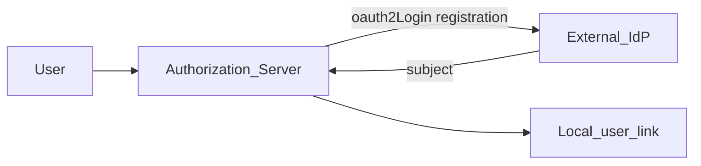

### Membership lifecycle

**Disable the user and revoke Spring Security sessions / refresh tokens when
access must end.** Record the management action in an append-only audit store.
Mirror invite → role → revoke flows used in App Store Connect Users and Access
and GitHub org membership.

### Machine credentials

**Prefer short-lived access tokens and AssumeRole-style elevation over shared
long-lived passwords for automation.** Scope machine clients like fine-grained
tokens / GitHub Apps installation tokens and Apple API keys—not human passwords.
See
[Managing personal access tokens](https://docs.github.com/en/authentication/keeping-your-account-and-data-secure/managing-your-personal-access-tokens).

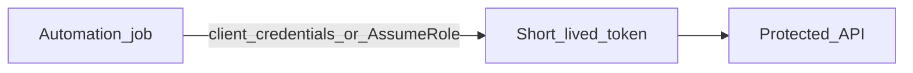

### Scopes and consent

**Configure least scopes on each `RegisteredClient` and on the app OAuth2 Client
registration.** Expand scopes only with a new consent / re-auth path on the
authorize endpoint.

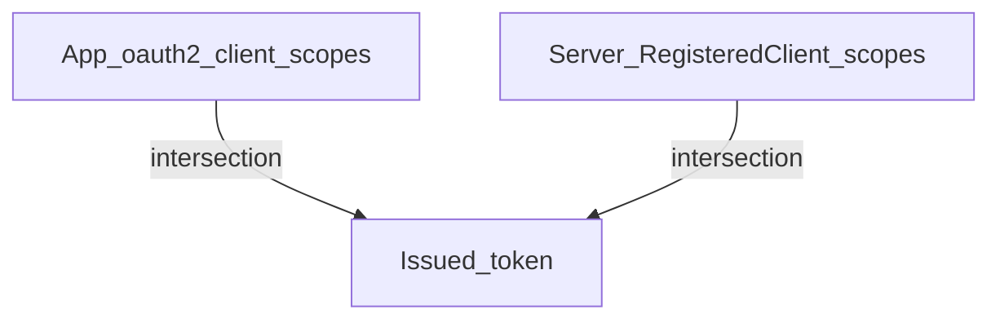

### Append-only audit

**Persist management and authorization outcomes as immutable records.** Query
endpoints return empty lists when nothing matches—not protocol errors.

### CSRF protection

**Keep Spring Security CSRF enabled for browser form posts and admin consoles.**
See
[Spring Security CSRF](https://docs.spring.io/spring-security/reference/servlet/exploits/csrf.html).

## Protocols and authorization platform

### OIDC Provider

**Expose OIDC through Spring Authorization Server endpoints (`/oauth2/*`,
`/.well-known/*`).** See
[Spring Authorization Server](https://docs.spring.io/spring-authorization-server/reference/index.html),
[OpenID Connect Core](https://openid.net/specs/openid-connect-core-1_0.html),
and
[Sign in with Apple REST API](https://developer.apple.com/documentation/sign_in_with_apple/sign_in_with_apple_rest_api).

### OAuth 2.1

**Limit `RegisteredClient` grants to Authorization Code (and optional refresh).**
Require PKCE for public clients. See
[OAuth 2.1](https://datatracker.ietf.org/doc/html/draft-ietf-oauth-v2-1) and
[RFC 9700](https://datatracker.ietf.org/doc/html/rfc9700).

### Issuer discovery and JWKS

**Publish discovery and JWKS from SAS; validate JWT `iss` with a
`JwtDecoder` / Resource Server issuer-uri.** Do not hard-code keys. See
[OpenID Connect Discovery](https://openid.net/specs/openid-connect-discovery-1_0.html).

## Identity

### IAM User

**Store the lasting principal as a durable user record and authenticate with
Spring Security form login.** Sessions expire; the user record stays auditable
and disableable. See
[Managing accounts](https://developer.apple.com/design/human-interface-guidelines/managing-accounts).

### Account disablement

**Disable the account and block further authentication, management, and
AssumeRole.** Revoke sessions and tokens; record the outcome in audit.

### Groups and roles

**Implement Group membership and attach shared policy to Group.** Use Role only
for AssumeRole-style elevation. See
[About teams](https://docs.github.com/en/organizations/organizing-members-into-teams/about-teams)
and
[Repository roles for an organization](https://docs.github.com/en/organizations/managing-user-access-to-your-organizations-repositories/managing-repository-roles/repository-roles-for-an-organization).

### MFA

**Add MFA or WebAuthn factors on the Security filter chain before granting
console or high-assurance sessions.** Prefer passkeys for phishing-resistant
sign-in. See
[Passkeys](https://developer.apple.com/passkeys),
[Requiring two-factor authentication in your organization](https://docs.github.com/en/organizations/keeping-your-organization-secure/managing-two-factor-authentication-for-your-organization/requiring-two-factor-authentication-in-your-organization),
and [NIST SP 800-63B](https://pages.nist.gov/800-63-4/sp800-63b.html).

### Password storage

**Hash passwords with Spring Security `PasswordEncoder` (never plaintext or
reversible storage).** See
[Password Storage](https://docs.spring.io/spring-security/reference/features/authentication/password-storage.html)
and
[OWASP Password Storage Cheat Sheet](https://cheatsheetseries.owasp.org/cheatsheets/Password_Storage_Cheat_Sheet.html).

## Policy

### Permission points

**Represent each check as Action + Resource (+ Condition).** Prefer fine-grained
Actions over coarse roles alone. Same granularity idea as GitHub fine-grained
PAT permissions.

### Policy evaluation

**Evaluate Deny before Allow, then deny by default in one policy service.** See
[The Protection of Information in Computer Systems](https://web.mit.edu/Saltzer/www/publications/protection/).

### Policy attachment

**Attach policies by durable principal identifiers (User / Group / Role ARN or
id).** Do not key grants on display names.

### Least privilege

**Grant only Actions an observable job needs; enforce with `@PreAuthorize` and
policy documents.** See
[Method Security](https://docs.spring.io/spring-security/reference/servlet/authorization/method-security.html)
and [NIST SP 800-207](https://csrc.nist.gov/pubs/sp/800/207/final).

## STS

### AssumeRole

**Issue temporary credentials only after a trust-policy check succeeds.** Do not
mint elevated tokens without that gate.

### Session expiration

**Enforce `exp` via the Resource Server JWT decoder and configured TTLs.** When
credentials expire, callers must AssumeRole again or fall back to narrower
rights.

### Token claims

**Validate JWT `iss`, `aud`, `exp`, and algorithms in the decoder.** Reject
`none` and weak algorithms. See [RFC 7519](https://datatracker.ietf.org/doc/html/rfc7519),
[RFC 8725](https://datatracker.ietf.org/doc/html/rfc8725), and
[OAuth2 Resource Server JWT](https://docs.spring.io/spring-security/reference/servlet/oauth2/resource-server/jwt.html).

## Federation and SSO

### Applications

**Treat each relying app as a `RegisteredClient` lifecycle.** Exact redirect
URIs; least scopes; return confidential secrets once on create. Capability
mirror: Apple app access and GitHub Apps.

### Federated identity link

**Resolve OAuth2 Login success into one stable local user link per external
subject.** See
[OAuth2 Login](https://docs.spring.io/spring-security/reference/servlet/oauth2/login/index.html)
and
[Sign in with Apple](https://developer.apple.com/design/human-interface-guidelines/sign-in-with-apple).

### Authorization endpoint

**Start OIDC at SAS `/oauth2/authorize`.** Keep client, redirect, and consent on
that trust path. See
[OpenID Connect Discovery](https://openid.net/specs/openid-connect-discovery-1_0.html).

### OIDC and SAML

**Prefer OAuth2 Client OIDC registrations for new IdPs.** Use Spring Security
SAML2 only when an enterprise IdP requires SAML 2.0. See
[Spring Security SAML2](https://docs.spring.io/spring-security/reference/servlet/saml2/index.html)
and
[SAML 2.0 Technical Overview](https://docs.oasis-open.org/security/saml/Post2.0/sstc-saml-tech-overview-2.0.html).

### SCIM

**Prefer SCIM for cross-system provisioning when you automate membership.** See
[SCIM 2.0](https://datatracker.ietf.org/doc/html/rfc7644).

## Audit

### Append-only records

**Write management and authorization history as immutable records.** Do not
update or delete decision rows.

### Audit queries

**Expose query APIs that reconstruct Allow and Deny.** Return an empty list when
nothing matches.

### CSRF protection

**Protect Console and form-login POSTs with Spring Security CSRF.** See
[Spring Security CSRF](https://docs.spring.io/spring-security/reference/servlet/exploits/csrf.html).

## Resources

### Related

[The Protection of Information in Computer Systems](https://web.mit.edu/Saltzer/www/publications/protection/)

[Role-Based Access Control Models](https://profsandhu.com/journals/computer/i94rbac%28org%29.pdf)

[OAuth 2.0 (RFC 6749)](https://datatracker.ietf.org/doc/html/rfc6749)

[OAuth 2.1 (Internet-Draft)](https://datatracker.ietf.org/doc/html/draft-ietf-oauth-v2-1)

[Bearer Token Usage (RFC 6750)](https://datatracker.ietf.org/doc/html/rfc6750)

[PKCE (RFC 7636)](https://datatracker.ietf.org/doc/html/rfc7636)

[OAuth 2.0 Security BCP (RFC 9700)](https://datatracker.ietf.org/doc/html/rfc9700)

[OpenID Connect Core](https://openid.net/specs/openid-connect-core-1_0.html)

[OpenID Connect Discovery](https://openid.net/specs/openid-connect-discovery-1_0.html)

[JSON Web Token (RFC 7519)](https://datatracker.ietf.org/doc/html/rfc7519)

[JSON Web Key (RFC 7517)](https://datatracker.ietf.org/doc/html/rfc7517)

[JWT Best Current Practices (RFC 8725)](https://datatracker.ietf.org/doc/html/rfc8725)

[SAML 2.0 Technical Overview](https://docs.oasis-open.org/security/saml/Post2.0/sstc-saml-tech-overview-2.0.html)

[SCIM 2.0 Protocol (RFC 7644)](https://datatracker.ietf.org/doc/html/rfc7644)

[NIST SP 800-63B](https://pages.nist.gov/800-63-4/sp800-63b.html)

[NIST SP 800-207 Zero Trust Architecture](https://csrc.nist.gov/pubs/sp/800/207/final)

[W3C Web Authentication (WebAuthn)](https://www.w3.org/TR/webauthn-3/)

[Managing accounts](https://developer.apple.com/design/human-interface-guidelines/managing-accounts)

[Sign in with Apple (HIG)](https://developer.apple.com/design/human-interface-guidelines/sign-in-with-apple)

[Privacy](https://developer.apple.com/design/human-interface-guidelines/privacy)

[Passkeys](https://developer.apple.com/passkeys)

[Overview of accounts and roles (App Store Connect)](https://developer.apple.com/help/app-store-connect/manage-your-team/overview-of-accounts-and-roles)

[Apple Developer Program roles](https://developer.apple.com/help/account/access/roles)

[Sign in to your developer account](https://developer.apple.com/help/account/access/sign-in-to-your-developer-account/)

[About teams (GitHub)](https://docs.github.com/en/organizations/organizing-members-into-teams/about-teams)

[Repository roles for an organization](https://docs.github.com/en/organizations/managing-user-access-to-your-organizations-repositories/managing-repository-roles/repository-roles-for-an-organization)

[About two-factor authentication](https://docs.github.com/en/authentication/securing-your-account-with-two-factor-authentication-2fa/about-two-factor-authentication)

[Requiring two-factor authentication in your organization](https://docs.github.com/en/organizations/keeping-your-organization-secure/managing-two-factor-authentication-for-your-organization/requiring-two-factor-authentication-in-your-organization)

[Managing personal access tokens](https://docs.github.com/en/authentication/keeping-your-account-and-data-secure/managing-your-personal-access-tokens)

[GitHub Apps](https://docs.github.com/en/apps)

### Developer documentation

[Spring Authorization Server](https://docs.spring.io/spring-authorization-server/reference/index.html)

[Core configuration model (RegisteredClient)](https://docs.spring.io/spring-authorization-server/reference/core/configuration-model.html)

[Spring Security OAuth2](https://docs.spring.io/spring-security/reference/servlet/oauth2/index.html)

[OAuth2 Login](https://docs.spring.io/spring-security/reference/servlet/oauth2/login/index.html)

[OAuth2 Resource Server JWT](https://docs.spring.io/spring-security/reference/servlet/oauth2/resource-server/jwt.html)

[Method Security](https://docs.spring.io/spring-security/reference/servlet/authorization/method-security.html)

[Spring Security Authentication](https://docs.spring.io/spring-security/reference/servlet/authentication/index.html)

[Password Storage](https://docs.spring.io/spring-security/reference/features/authentication/password-storage.html)

[Spring Security SAML2](https://docs.spring.io/spring-security/reference/servlet/saml2/index.html)

[Spring Security CSRF](https://docs.spring.io/spring-security/reference/servlet/exploits/csrf.html)

[Authentication Services](https://developer.apple.com/documentation/authenticationservices)

[Sign in with Apple](https://developer.apple.com/documentation/signinwithapple)

[Sign in with Apple REST API](https://developer.apple.com/documentation/sign_in_with_apple/sign_in_with_apple_rest_api)

[Glossary](Glossary.md)

[C4 model](developer/c4-model/) — optional living architecture for this repo;
prefer the Mermaid diagrams above as the integration target.

[User guide](user-guide/README.md)

[Relying party integration](user-guide/relying-party.md)
