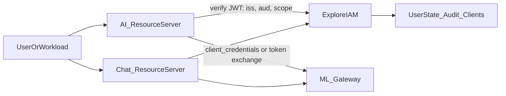
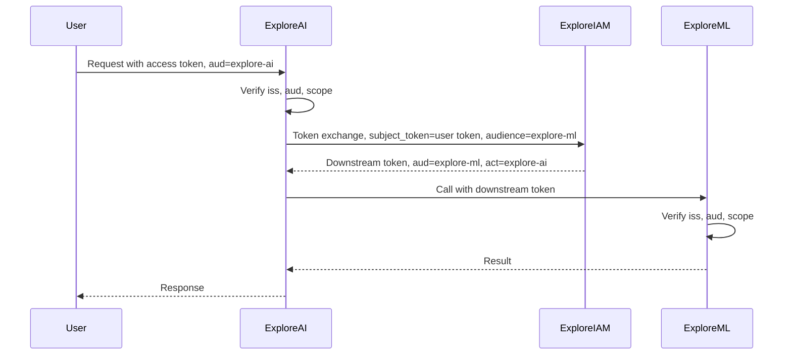
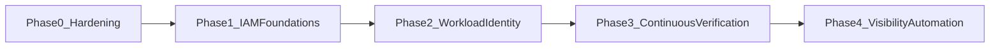

# Explore 零信任架构

> 以 Explore IAM 为身份中枢，覆盖 Explore AI、Explore Chat、Explore ML 的零信任现状、差距与分阶段路线图。

术语以 [Glossary §5.6 Zero Trust](../../Glossary.md#56-zero-trust--零信任) 为准；目标拓扑见
[C4-ZeroTrust-Target.puml](../c4-model/C4-ZeroTrust-Target.puml)。

---

## 1. 目的与范围

本文回答三个问题：

1. Explore 生态里，谁负责做访问决策、谁负责执行决策？
2. 按零信任的要求，现在做到了哪一步，还差什么？
3. 按什么顺序补齐，每一步的完成标准是什么？

**范围内**

| 系统 | 角色 | 主要部署 |
| ---- | ---- | -------- |
| explore-iam | 身份提供方（OIDC Provider）、策略引擎、STS、审计 | Render（Docker） |
| explore-ai | 资源服务器 + Web BFF + iOS 客户端 | Render（API）+ Vercel（SPA） |
| explore-chat | 资源服务器 + Socket.IO 网关 + Web / Admin / Expo / iOS 客户端 | 本地（部署规划中） |
| explore-ml | Python 推理服务（RAG、推荐、语音、视觉、图像、视频） | 本地 / 回环上游 |

**范围外**：外部大模型与第三方 SaaS（DeepSeek、OpenAI、Resend 等）自身的安全；
物理与办公网络；具体漏洞细节（见 [§9](#9-安全披露说明)）。

---

## 2. 原则

### 2.1 NIST SP 800-207 基本原则

1. 所有数据源和计算服务都视为资源。
2. 无论网络位置如何，所有通信都必须加密并认证。
3. 对资源的访问按**每个会话**授予，并遵循最小权限。
4. 访问由动态策略决定：主体身份、应用、设备状态、行为与环境属性。
5. 持续监测所有资产的完整性和安全状态。
6. 认证与授权是动态的，并在访问前严格执行。
7. 尽可能收集资产、网络和通信的状态信息，用来改进安全态势。

### 2.2 BeyondCorp：不信任网络位置

内网、回环地址、同一云厂商的私有网络都**不等于**可信。每个请求都要回答
"你是谁、代表谁、要做什么、凭什么允许"。网络隔离是纵深防御的一层，不是授权依据。

### 2.3 CISA ZTMM v2 支柱

| 支柱 | Explore 关注点 |
| ---- | -------------- |
| 身份（Identity） | IamUser、OIDC 登录、MFA、会话与令牌生命周期 |
| 设备（Devices） | iOS / Web / Expo 客户端的令牌存储与设备证明 |
| 网络（Networks） | 服务间链路加密、私有网络、CORS 与 origin 白名单 |
| 应用与工作负载（Applications & Workloads） | 资源服务器的 PEP、服务身份、scope 与 audience |
| 数据（Data） | 元数据库、签名密钥、审计数据的存储与加密 |
| 贯穿项 | 可见性与分析、自动化与编排、治理 |

成熟度等级沿用 CISA ZTMM v2：**Traditional → Initial → Advanced → Optimal**。

---

## 3. 参考模型与 Explore 的对应关系

| NIST 组件 | Explore 实现 | 状态 |
| --------- | ------------ | ---- |
| PDP（策略决策点） | explore-iam：签发令牌时决定 scope；`PolicyEngine`（Deny > Allow > 隐式拒绝）；Permission Point 目录 | partial |
| PEP（策略执行点） | explore-ai / explore-chat 的 Spring Security 资源服务器；Chat Socket.IO 网关；ML 网关（目标） | partial |
| PIP（策略信息点） | IamUser 状态（启用 / 禁用）、角色与组、客户端注册、审计事件 | partial |

**决策与执行的分工**

- **签发时决策**：IAM 根据客户端注册、用户身份和 Permission Point 决定令牌里放哪些 scope。
- **请求时执行**：资源服务器校验 `iss`、签名、有效期、`aud`，再按路由要求的 scope 放行。
- **高风险操作**：目标是由资源服务器向 IAM 发起实时策略评估（PolicyEngine 作为在线 PDP）。

---

## 4. 各支柱现状

以下事实来自对四个仓库的代码审计（2026-10）。

### 4.1 身份 — Initial

**已具备**

- OIDC Authorization Code；iOS 公共客户端强制 PKCE（`OidcClientMapper` 中 `requireProofKey`）。
- 密码使用 bcrypt（`DelegatingPasswordEncoder`）。
- 管理员可禁用 / 启用用户、重置密码，且有管理审计。
- 表单登录配合 SPA，CSRF 使用 Cookie + `X-XSRF-TOKEN`。

**缺失**

- 没有 MFA（TOTP、WebAuthn、Passkey 均未实现）。
- 禁用用户不会终止已有会话、令牌或 STS 会话。
- 没有自助改密、邮箱验证、密码策略、登录限流与锁定。

### 4.2 令牌与密钥 — Initial

**已具备**

- RSA 签名密钥持久化，重启后 JWKS 不变（`PersistentJwkSourceConfig`）。
- 访问令牌带 `permissions` claim（已授予的产品 scope）。

**缺失**

- 按客户端的 `TokenSettings` 没有生效：`OidcClientMapper` 使用 `TokenSettings.builder().build()`
  默认值，独立定义的 `TokenSettings` Bean 未被引用，因此 refresh token 不轮换。
- 授权记录（含 refresh token、吊销状态）只在内存中，没有 JDBC `OAuth2AuthorizationService`。
- 私钥以明文存储，没有密钥轮换和多密钥 JWKS。
- 令牌没有 `aud`，资源服务器无法区分"这张令牌是发给谁的"。
- `email_verified` 固定为 `true`，与实际验证状态无关。

### 4.3 授权 — Initial

**已具备**

- GitHub 风格 scope（`write:ai_chat`、`admin:chat` 等）与 Permission Point 目录。
- `PolicyEngine` 实现 Deny > Allow > 隐式拒绝，并记录 `AuthorizationDecisionLog`。
- 管理 API 使用 `@PreAuthorize` 做 RBAC（`IAM_ADMIN` / `IAM_AUDITOR`）。

**缺失**

- `PolicyEngine` 只通过 `:evaluate`（what-if）调用，没有真正挡在任何请求前面。
- 用户登录后能拿到客户端请求的全部 scope，没有按用户的 scope 授权。
- STS 的 Trust Policy 只存储不评估；没有 Condition（ABAC），没有组 / 角色继承。

### 4.4 应用与工作负载 — Traditional / Initial

**已具备**

- explore-ai、explore-chat 都作为 OAuth2 资源服务器校验 IAM JWT（issuer 发现 + JWKS）。
- 两个应用都把 `scope` 映射为 `SCOPE_*` 权限，并按模块路由要求 scope。
- Chat 的 Socket.IO 连接要求 IAM 令牌包含 `write:chat_messaging`。

**缺失**

- explore-ai 的 scope 校验只对 Bearer 请求生效；Cookie 与访客身份的请求不经过 scope 判断。
- explore-chat 把不带 scope 的 IAM 令牌映射为 `ROLE_USER`，等同于完整的消息与社交权限。
- 两个应用都不校验 `aud`，一个应用的令牌可以在另一个应用使用。
- 服务到服务调用（AI → ML、Chat → ML）没有工作负载身份，也没有调用方认证。
- explore-ml 尚无 PEP：没有入站认证，网络隔离也未按"仅回环"的设计落实。
- 用户提供 URL 的抓取（图片、网页）缺少出站白名单与私网地址拦截。

### 4.5 网络 — Traditional

**已具备**

- 公网入口（Render、Vercel）由平台终止 TLS；IAM 与 AI 配置了 `forward-headers-strategy`。
- explore-ai 有 CORS 白名单、安全响应头（CSP、`X-Frame-Options` 等）。

**缺失**

- 服务间链路（AI / Chat → ML、Chat → Kafka）是明文。
- explore-chat 的 CORS 与 Socket.IO origin 为 `*`。
- 没有微分段：ML、Kafka、数据库与公网服务之间没有明确的网络边界。

### 4.6 数据 — Traditional

**已具备**

- 审计事件在应用层不可变（`AbstractImmutable`，无更新接口）。

**缺失**

- IAM 生产环境使用 H2 文件库，位于 Render 临时磁盘；重新部署会丢失用户、客户端、
  审计与签名密钥。目标 PostgreSQL 尚未接入。
- 没有静态加密、备份与恢复演练。
- 部分服务的开发默认凭据在未配置环境变量时会生效。

### 4.7 设备 — Initial

**已具备**

- iOS（AI、Chat）使用 `ASWebAuthenticationSession` + PKCE S256，并校验 `state`。
- iOS 令牌存于 Keychain。

**缺失**

- 没有 App Attest / DeviceCheck 设备证明。
- Chat Web / Admin 把令牌存在 `localStorage`，暴露在 XSS 风险下。
- AI iOS 丢弃 refresh token；Keychain 条目未显式设置可访问级别。

### 4.8 可见性与分析 — Initial

**已具备**

- IAM 记录管理操作、登录成功 / 失败、策略评估决策。
- explore-ai 有调用计量与 Prometheus 指标（开发环境）。

**缺失**

- 没有跨服务关联 ID（correlation ID）。
- 没有令牌签发 / 刷新 / 吊销事件；失败的管理操作不记录；登录事件没有来源 IP 与客户端。
- 没有 SIEM 导出、异常检测、审计保留策略。

### 4.9 成熟度总览

| 支柱 | 当前 | 阶段 2 后目标 | 最终目标 |
| ---- | ---- | ------------- | -------- |
| 身份 | Initial | Advanced | Optimal |
| 令牌与密钥 | Initial | Advanced | Advanced |
| 授权 | Initial | Advanced | Optimal |
| 应用与工作负载 | Traditional | Advanced | Optimal |
| 网络 | Traditional | Initial | Advanced |
| 数据 | Traditional | Initial | Advanced |
| 设备 | Initial | Initial | Advanced |
| 可见性与分析 | Initial | Initial | Advanced |

---

## 5. 差距分析

### 5.1 身份

| 现状 | 目标 | 风险 | 负责仓库 |
| ---- | ---- | ---- | -------- |
| 仅密码登录 | WebAuthn / Passkey 优先的 MFA | 凭据泄露即账户失陷 | explore-iam |
| 禁用用户不吊销 | 禁用即吊销会话、refresh token、STS 会话 | 离职 / 停用后仍可访问 | explore-iam |
| 无登录限流 | 按账户与来源限流、渐进延迟 | 暴力破解与撞库 | explore-iam、explore-chat |

### 5.2 令牌与密钥

| 现状 | 目标 | 风险 | 负责仓库 |
| ---- | ---- | ---- | -------- |
| 按客户端 TokenSettings 未生效 | 每客户端显式 TTL，refresh 轮换（`reuseRefreshTokens(false)`） | refresh token 被盗后长期有效 | explore-iam |
| 授权记录只在内存 | JDBC `OAuth2AuthorizationService` + PostgreSQL | 重启丢失吊销状态；无法水平扩展 | explore-iam |
| 单密钥、明文存储 | KMS 托管或加密存储；多密钥 JWKS 定期轮换 | 私钥泄露影响所有令牌 | explore-iam |
| 令牌无 `aud` | RFC 8707 resource indicators，按服务签发 audience | 令牌跨应用重放 | explore-iam、AI、Chat |

### 5.3 授权

| 现状 | 目标 | 风险 | 负责仓库 |
| ---- | ---- | ---- | -------- |
| 所有用户获得全部请求 scope | 按用户 / 组 / 角色授予 scope | 过度授权 | explore-iam |
| PolicyEngine 仅 what-if | 在线 PDP，支持 Condition（ABAC）与继承 | 策略形同虚设 | explore-iam |
| STS Trust Policy 不评估 | AssumeRole 前评估信任策略 | 越权扮演高权限角色 | explore-iam |

### 5.4 应用与工作负载

| 现状 | 目标 | 风险 | 负责仓库 |
| ---- | ---- | ---- | -------- |
| AI scope 校验仅限 Bearer | 所有调用方路径统一经过 scope / 权限判断 | 绕过 scope 边界 | explore-ai |
| Chat 无 scope 令牌映射为 `ROLE_USER` | 无 scope 即拒绝；本地令牌与 IAM 令牌分开授权 | 过度授权 | explore-chat |
| 服务间无身份 | `client_credentials` 服务身份 + token exchange | 横向移动、冒用 | AI、Chat、ML、IAM |
| ML 无 PEP | FastAPI 依赖校验 IAM JWT（`iss`、`aud`、scope） | 未授权调用推理与数据接口 | explore-ml |
| URL 抓取无出站控制 | 出站白名单、私网地址拦截、大小与超时限制 | SSRF | explore-ai、explore-ml |

### 5.5 网络、数据、设备、可见性

| 现状 | 目标 | 风险 | 负责仓库 |
| ---- | ---- | ---- | -------- |
| 服务间明文 | TLS（内部可选 mTLS）；Kafka TLS + SASL | 链路窃听与篡改 | Chat、ML、平台 |
| CORS / origin 为 `*` | 明确的 origin 白名单 | 跨站滥用 | explore-chat |
| H2 临时磁盘 | PostgreSQL、静态加密、备份与恢复演练 | 数据与密钥丢失 | explore-iam |
| 浏览器 `localStorage` 存令牌 | BFF 会话 Cookie（`HttpOnly`、`Secure`、`SameSite`） | XSS 窃取令牌 | explore-chat |
| 无设备证明 | iOS App Attest；高风险操作要求设备证明 | 伪造客户端 | AI iOS、Chat iOS、IAM |
| 无关联 ID / SIEM | W3C Trace Context 贯穿；审计导出到只追加存储 | 无法追溯与响应 | 全部 |

---

## 6. 目标架构

### 6.1 用户到服务

- 所有客户端使用 OIDC Authorization Code + PKCE（含机密客户端）。
- 访问令牌短时效（建议 5–15 分钟），按 RFC 8707 绑定 `aud`，只包含该服务需要的 scope。
- refresh token 一次一换（轮换），检测到重用即吊销整条令牌族（RFC 9700）。
- MFA 以 WebAuthn / Passkey 为主，TOTP 为备选；按风险触发 step-up 认证。
- 禁用用户、重置密码、检测到异常时，吊销其会话、refresh token 和 STS 会话。
- 浏览器端优先 BFF 模式：令牌留在服务端，浏览器只持有 `HttpOnly` 会话 Cookie。

### 6.2 服务到服务

- 每个工作负载在 IAM 注册一个 `client_credentials` 客户端，作为**服务身份**。
- 服务自身发起的调用：使用服务身份令牌，`aud` 为被调服务。
- 代表用户的调用：用 RFC 8693 token exchange 把用户令牌换成下游令牌，
  保留 `sub`（用户）并用 `act` 标明调用方服务，scope 只缩不扩。
- explore-ml 引入 PEP：统一的 FastAPI 依赖校验 IAM JWT 的 `iss`、签名、`exp`、`aud` 与 scope。
- ML 迁入私有网络，只接受来自网关或已知服务的流量；网络隔离与令牌校验同时存在。

### 6.3 发送方约束令牌

- 公共客户端（iOS、SPA）后续引入 DPoP（RFC 9449），令牌绑定客户端密钥，被盗后无法重放。
- 内部工作负载可选 mTLS 绑定令牌（RFC 8705），与服务网格或平台私有网络配合。

### 6.4 持续验证

- PolicyEngine 作为在线 PDP：高风险操作（管理、导出、删除）在执行前请求实时决策。
- 策略支持 Condition（时间、来源网络、设备证明、MFA 新鲜度）与组 / 角色展开。
- STS 在 AssumeRole 前评估 Trust Policy；临时凭证带 `aud`、`jti`，并可单独吊销。
- 风险信号（异常登录、令牌重用、频率突增）反馈到 PDP，触发 step-up 或吊销。

### 6.5 数据与密钥

- IAM 迁移到 PostgreSQL，接入 JDBC `OAuth2AuthorizationService` 与
  `OAuth2AuthorizationConsentService`。
- 签名密钥由 KMS 托管，或以信封加密方式存储；JWKS 同时发布当前与下一把密钥，按周期轮换。
- 数据库与备份启用静态加密，定期做恢复演练。
- 所有密钥与凭据只来自密钥管理服务或平台密钥变量，生产环境不存在默认值。

### 6.6 可见性

- 所有服务透传 W3C Trace Context（`traceparent`），日志与审计事件带关联 ID。
- IAM 增加令牌签发、刷新、吊销、交换事件，以及失败的管理操作。
- 审计写入只追加的外部存储，按保留策略归档，可导出到 SIEM。

---

## 7. 分阶段路线图

### 阶段 0：立即加固

| 事项 | 仓库 |
| ---- | ---- |
| ML 只监听私有网络或回环地址，并加上入站认证 | explore-ml |
| AI 的 scope 校验覆盖所有调用方路径 | explore-ai |
| AI、Chat 校验令牌 `aud`（IAM 侧先为每个客户端设置 audience） | explore-iam、AI、Chat |
| 移除生产环境默认凭据；生产 issuer 等环境变量显式配置 | 全部 |
| 加固 Chat 本地凭证流程（密码重置、登录限流） | explore-chat |

**退出标准**：无未认证的服务入口；跨应用令牌被拒绝；生产配置不依赖默认值。

### 阶段 1：IAM 基础

| 事项 | 仓库 |
| ---- | ---- |
| 按客户端的 TokenSettings 生效，开启 refresh 轮换 | explore-iam |
| JDBC 授权服务 + PostgreSQL | explore-iam |
| 签名密钥加密存储与轮换 | explore-iam |
| MFA（WebAuthn 优先） | explore-iam |
| 禁用即吊销（会话、refresh token、STS） | explore-iam |

**退出标准**：IAM 重启 / 扩容不丢授权状态；refresh 重用可检测；管理员账户强制 MFA。

### 阶段 2：工作负载身份

| 事项 | 仓库 |
| ---- | ---- |
| 为 AI、Chat、ML 注册 `client_credentials` 服务身份 | explore-iam |
| AI / Chat → ML 使用 token exchange | explore-iam、AI、Chat |
| ML PEP（FastAPI JWT 依赖） | explore-ml |
| Kafka TLS + SASL；服务间 TLS | explore-chat、平台 |
| CORS 与 Socket.IO origin 白名单 | explore-chat |
| URL 抓取出站白名单与私网拦截 | explore-ai、explore-ml |

**退出标准**：每条服务间调用都能回答"哪个服务、代表哪个用户、用什么 scope"。

### 阶段 3：持续验证

| 事项 | 仓库 |
| ---- | ---- |
| PolicyEngine 在线执行，支持 Condition 与组 / 角色继承 | explore-iam |
| 按用户授予 scope | explore-iam |
| STS Trust Policy 评估 | explore-iam |
| DPoP（iOS、SPA） | explore-iam、AI、Chat |
| iOS App Attest | AI iOS、Chat iOS、explore-iam |

**退出标准**：高风险操作经 PDP 实时决策；被盗令牌无法在其他设备重放。

### 阶段 4：可见性与自动化

| 事项 | 仓库 |
| ---- | ---- |
| 关联 ID 贯穿全部服务 | 全部 |
| 令牌生命周期审计 + 只追加审计存储 + SIEM 导出 | explore-iam、平台 |
| 异常检测（登录、令牌重用、频率） | explore-iam |
| 密钥与凭据自动轮换 | 平台 |

**退出标准**：任一请求可端到端追溯；关键凭据无需人工轮换。

---

## 8. 参考资料

- NIST SP 800-207 Zero Trust Architecture — https://csrc.nist.gov/pubs/sp/800/207/final
- NIST SP 800-207A（云原生多位置环境的访问控制）— https://csrc.nist.gov/pubs/sp/800/207/a/final
- CISA Zero Trust Maturity Model v2.0 — https://www.cisa.gov/zero-trust-maturity-model
- Google BeyondCorp: A New Approach to Enterprise Security — https://research.google/pubs/beyondcorp-a-new-approach-to-enterprise-security/
- RFC 9700 OAuth 2.0 Security Best Current Practice — https://www.rfc-editor.org/rfc/rfc9700
- RFC 8707 Resource Indicators for OAuth 2.0 — https://www.rfc-editor.org/rfc/rfc8707
- RFC 8693 OAuth 2.0 Token Exchange — https://www.rfc-editor.org/rfc/rfc8693
- RFC 9449 OAuth 2.0 DPoP — https://www.rfc-editor.org/rfc/rfc9449
- RFC 8705 OAuth 2.0 Mutual-TLS — https://www.rfc-editor.org/rfc/rfc8705
- Apple App Attest — https://developer.apple.com/documentation/devicecheck/establishing-your-app-s-integrity
- W3C Trace Context — https://www.w3.org/TR/trace-context/
- Spring Authorization Server Reference — https://docs.spring.io/spring-authorization-server/reference/index.html
- Spring Security OAuth2 Resource Server JWT — https://docs.spring.io/spring-security/reference/servlet/oauth2/resource-server/jwt.html

---

## 9. 安全披露说明

本仓库公开。本文只描述架构层面的能力差距，不包含可复现的利用步骤。
审计中发现的严重问题应通过私有渠道跟踪并优先修复，在本文中仅以阶段 0 事项出现。

---

## 附录 A：文档与代码不一致（后续处理）

| 位置 | 不一致 |
| ---- | ------ |
| [Glossary](../../Glossary.md) §5 Token Settings、Least Privilege Session | 标为 implemented，但按客户端 TokenSettings 未生效，STS 默认 1 小时 |
| [Glossary](../../Glossary.md) Trust Policy | 标为 implemented，但从未被评估 |
| [Glossary](../../Glossary.md) §10 审计动作 | `CreateUser`、`EnableUser`、`ResetPassword` 等已实现，仍标为 planned |
| [Glossary](../../Glossary.md) JWK 映射 | 实际位于 `PersistentJwkSourceConfig`，而非 `AuthorizationServerConfig` |
| [C4-Dynamic-PolicyEvaluation.puml](../c4-model/C4-Dynamic-PolicyEvaluation.puml) | 信任策略检查、拒绝返回 403、受策略保护的 API 调用等步骤代码未实现 |
