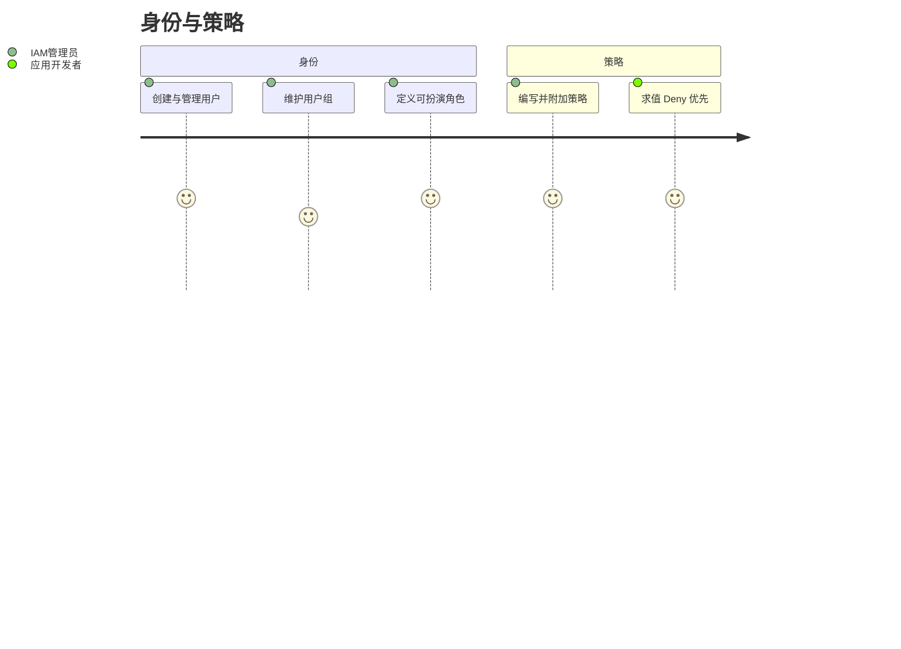
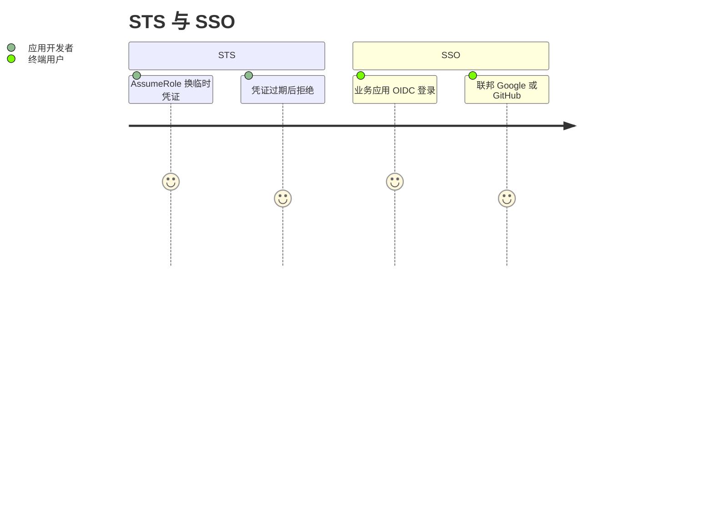
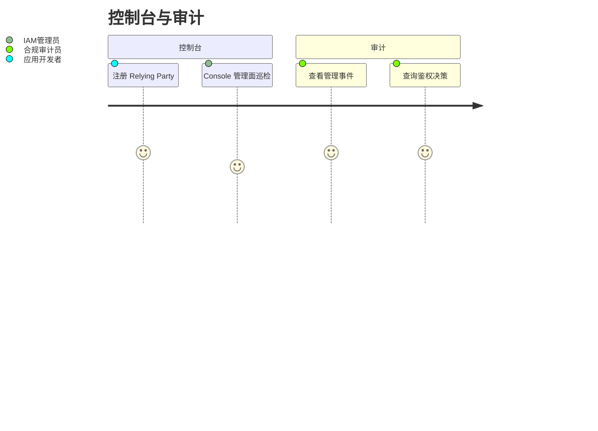

# 用户故事地图

> 格式：Jeff Patton 故事地图 + Mermaid journey + GWT（Epic 分文件）。  
> 故事正文与验收标准见 [user-stories/](./user-stories/)；本页只做索引，避免双源。

## 用户画像

| 角色 | 说明 |
|------|------|
| 终端用户 | 经 SSO 登录业务应用（Explore AI 等） |
| IAM 管理员 | 在 Console 管理用户、组、角色、策略与客户端 |
| 应用开发者 | 注册 Relying Party、集成 OIDC 与鉴权 |
| 合规审计员 | 查询管理事件与鉴权决策日志 |

## 旅程总览

### 身份与策略

### STS 与 SSO

### 控制台与审计

---

## Backbone 故事地图

### 规划中

| 身份 | 策略 | STS | SSO | 控制台与客户端 | 审计 |
|------|------|-----|-----|----------------|------|
| [US-01](./user-stories/E1-identity.md#us-01-管理-iam-用户) 管理用户 | [US-04](./user-stories/E2-policy.md#us-04-编写并附加策略) 编写/附加策略 | [US-06](./user-stories/E3-sts.md#us-06-assumerole) AssumeRole | [US-08](./user-stories/E4-sso-federation.md#us-08-oidc-登录业务应用) OIDC 登录 | [US-10](./user-stories/E5-console-clients.md#us-10-注册-relying-party) 注册客户端 | [US-12](./user-stories/E6-audit.md#us-12-管理事件) 管理事件 |
| [US-02](./user-stories/E1-identity.md#us-02-管理用户组) 组 | [US-05](./user-stories/E2-policy.md#us-05-策略求值-deny-优先于-allow) 求值 Deny>Allow | [US-07](./user-stories/E3-sts.md#us-07-临时凭证过期) 凭证过期 | [US-09](./user-stories/E4-sso-federation.md#us-09-联邦-googlegithub) 联邦 IdP | [US-11](./user-stories/E5-console-clients.md#us-11-console-管理面) Console | [US-13](./user-stories/E6-audit.md#us-13-鉴权决策查询) 鉴权查询 |
| [US-03](./user-stories/E1-identity.md#us-03-管理角色) 角色 | | | | | |

---

## Epic 索引

| Epic | 文件 | 故事 | 状态 |
|------|------|------|------|
| E1 身份 | [E1-identity.md](./user-stories/E1-identity.md) | US-01 – US-03 | 规划中 |
| E2 策略 | [E2-policy.md](./user-stories/E2-policy.md) | US-04 – US-05 | 规划中 |
| E3 STS | [E3-sts.md](./user-stories/E3-sts.md) | US-06 – US-07 | 规划中 |
| E4 SSO 与联邦 | [E4-sso-federation.md](./user-stories/E4-sso-federation.md) | US-08 – US-09 | US-08 已实现 / US-09 规划中 |
| E5 控制台与客户端 | [E5-console-clients.md](./user-stories/E5-console-clients.md) | US-10 – US-11 | US-10 已实现 / US-11 规划中 |
| E6 审计 | [E6-audit.md](./user-stories/E6-audit.md) | US-12 – US-13 | 规划中 |

## 参考

- [User Story Mapping — Jeff Patton](https://www.jpattonassociates.com/user-story-mapping/)
- [Domain Glossary](../Glossary.md)
- [AWS IAM User Guide](https://docs.aws.amazon.com/IAM/latest/UserGuide/introduction.html)
