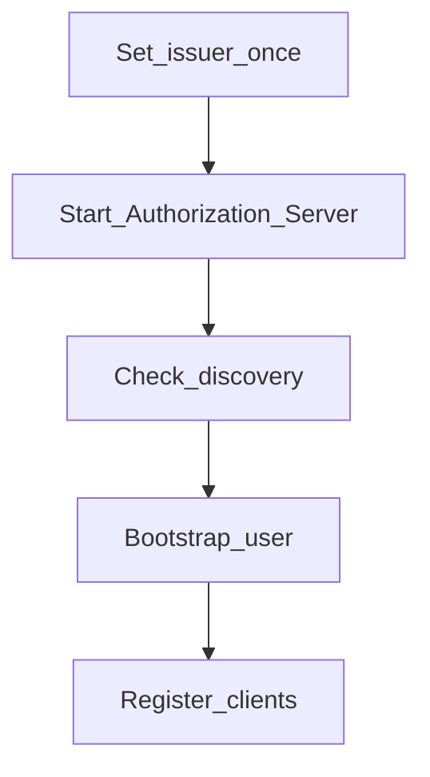

# Operator setup

← [User guide home](README.md)

Stand up Spring Authorization Server with the smallest durable config: one
issuer, one bootstrap user, and clients you can register from YAML or an admin
UI. Treat this as the integration target; adjust implementation to match.

## Steps

1. Choose one issuer URL and never fork it per app (example:
   `http://localhost:9000`).
2. Configure the Authorization Server issuer (Spring Boot property):

```yaml
spring:
  security:
    oauth2:
      authorizationserver:
        issuer: http://localhost:9000
server:
  port: 9000
```

3. Start the Authorization Server process (your Boot app / container). Keep the
   public base URL identical to `issuer`.
4. Verify discovery and JWKS:

```bash
export ISSUER=http://localhost:9000
curl -s "$ISSUER/.well-known/openid-configuration" | jq '{issuer, authorization_endpoint, token_endpoint, jwks_uri}'
curl -s "$ISSUER/oauth2/jwks" | jq '.keys | length'
```

5. Ensure at least one local user can sign in (form login +
   `PasswordEncoder`). Prefer env or secrets manager for passwords—never commit
   them.
6. Register clients (see below), then smoke-test authorize → token.



## Register clients the easy way

### YAML bootstrap (local / first client)

Prefer property- or bean-driven `RegisteredClient` for the first confidential
app: exact redirect URIs, least scopes (`openid`, `profile`, `email`),
`authorization_code` (+ optional refresh), PKCE required for public clients.

### Admin UI or API (ongoing)

Sign in as an operator, create a client, copy the secret **once**, store it only
on the relying-party server.

## Optional SPA / console front end

If the provider ships a browser console, serve it behind the same issuer origin
when you can. If you use a separate dev server, proxy `/oauth2/**`, `/login`, and
discovery to the Authorization Server so cookies and redirects stay consistent.

## Environment checklist

Set these once and keep them aligned:

- **Issuer** — public base URL clients call (`issuer` / `OIDC_ISSUER`)
- **Port / TLS** — whatever serves that issuer URL
- **Bootstrap operator** — username + hashed password for console / form login
- **Client credentials** — per relying party; rotate without changing issuer

Do not commit real secrets.

## If something fails

- Discovery `issuer` ≠ browser URL — fix issuer or reverse-proxy `Host` /
  forwarded headers so they match.
- Login loop — redirect URI must match **exactly** (scheme, host, port, path).
- Token endpoint 401 — confidential clients send `client_secret` on the back
  channel only (`client_secret_basic` or `client_secret_post`).
- JWT rejected on APIs — resource server `issuer-uri` must equal Authorization
  Server issuer.

## Related

[User guide home](README.md)

[Relying party integration](relying-party.md)

[Guideline](../Guideline.md)
