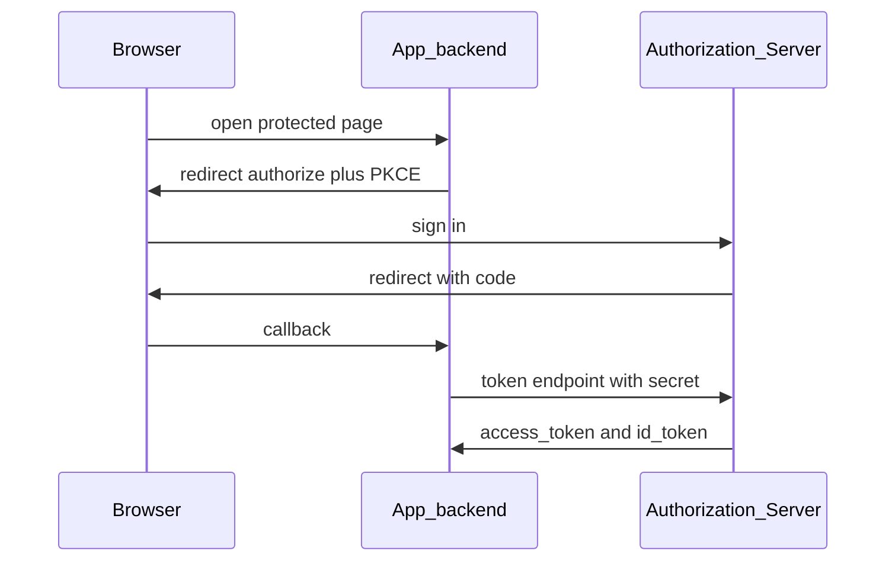

# Relying party integration

← [User guide home](README.md)

Connect any app to the Authorization Server with Spring Security OAuth2 Client
and Resource Server. One `issuer-uri`. Authorization Code on the browser path.
Token exchange and secrets on the server only.

## Before you start

1. Authorization Server is up ([Operator setup](operator-setup.md)).
2. Discovery returns your issuer:

```bash
curl -s "$ISSUER/.well-known/openid-configuration" | jq .issuer
```

3. You have a `RegisteredClient`: `client_id`, secret (confidential), exact
   redirect URI(s), and least scopes.

## Wire Spring Boot (recommended)

Use the same issuer for **client** and **resource server**. Let discovery fill
authorize, token, and JWKS URLs—do not hard-code them.

```yaml
spring:
  security:
    oauth2:
      client:
        provider:
          iam:
            issuer-uri: ${ISSUER:http://localhost:9000}
        registration:
          iam:
            provider: iam
            client-id: ${OAUTH2_CLIENT_ID}
            client-secret: ${OAUTH2_CLIENT_SECRET}
            scope: openid, profile, email
            redirect-uri: "{baseUrl}/login/oauth2/code/{registrationId}"
            client-authentication-method: client_secret_basic
            authorization-grant-type: authorization_code
      resourceserver:
        jwt:
          issuer-uri: ${ISSUER:http://localhost:9000}
```

Register the resolved redirect URI on the Authorization Server exactly as Spring
builds it (for local apps, often
`http://localhost:<app-port>/login/oauth2/code/iam`).



## Checklist

1. Set `ISSUER` / `issuer-uri` to the Authorization Server base URL.
2. Set `client_id` and `client_secret` from registration (secret never in SPA
   bundles).
3. Match redirect URI on both sides.
4. Start login through the OAuth2 Client filter chain (authorize redirect)—not a
   custom IdP URL.
5. Exchange the code at `/oauth2/token` on the **server**.
6. Call APIs with the access token; Resource Server validates via JWKS from the
   same issuer.

## Public / SPA clients

Prefer a BFF or confidential backend. If the client is public, require PKCE, omit
client secrets, and keep tokens out of long-lived local storage when you can.

## Native public clients (iOS)

Local bootstrap seeds public clients with `public-client: true` and
`requireProofKey(true)`:

| client_id | redirect URI |
| --- | --- |
| `explore-ai-ios` | `com.explore.ai://oauth/callback` |
| `explore-chat-ios` | `com.explore.chat://oauth/callback` |

Use Authorization Code + PKCE from the device (`ASWebAuthenticationSession`):

1. `GET $ISSUER/oauth2/authorize` with `client_id`, `redirect_uri`, `scope`,
   `response_type=code`, `code_challenge`, `code_challenge_method=S256`.
2. User signs in on the Authorization Server (demo: `demo` / `demo-password`).
3. App receives `code` on the custom scheme callback.
4. `POST $ISSUER/oauth2/token` with `grant_type=authorization_code`, `code`,
   `redirect_uri`, `code_verifier`, and `client_id` (no secret).
5. Call Explore AI / Chat APIs with `Authorization: Bearer <access_token>`.

Issuer for local defaults is `http://localhost:9100`.

## Manual token check (optional)

After a browser authorize round-trip yields a `code`:

```bash
curl -s -X POST "$ISSUER/oauth2/token" \
  -u "$OAUTH2_CLIENT_ID:$OAUTH2_CLIENT_SECRET" \
  -H 'Content-Type: application/x-www-form-urlencoded' \
  -d 'grant_type=authorization_code' \
  -d "code=$CODE" \
  -d "redirect_uri=$REDIRECT_URI"
```

## Smoke test

1. Open a protected page in the app.
2. Confirm redirect to the Authorization Server login.
3. Sign in.
4. Confirm callback with `code` and a successful server-side token exchange.
5. Call a protected API with the access token (or session established by the
   client).

## Related

[Operator setup](operator-setup.md)

[User guide home](README.md)

[Guideline](../Guideline.md)
